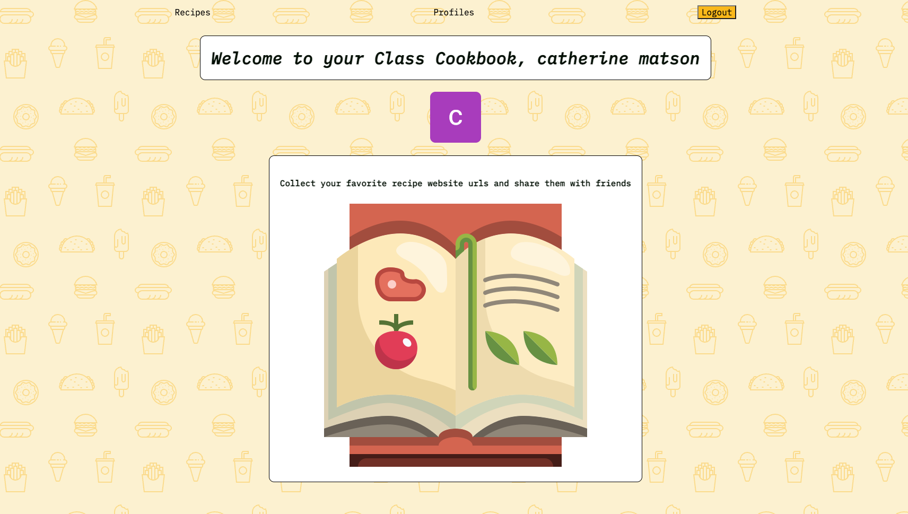

# Class Cookbook is a recipe collector app

# [Open the app here](https://recipe-collector.fly.dev/) 

## Technologies used
* JavaScript
* Express
* Node JS
* Mongoose
* CSS
* HTML
* Git
* Fly.io
* Trello

## Credits
<a href="https://www.flaticon.com/free-icons/ketchup" title="ketchup icons">Ketchup icons created by justicon - Flaticon</a>

<a href="https://www.flaticon.com/free-icons/french-toast" title="french-toast icons">French-toast icons created by justicon - Flaticon</a>

<a href="https://www.flaticon.com/free-icons/recipe" title="recipe icons">Recipe icons created by justicon - Flaticon</a>

## Icebox
* Responsive and mobile design
* Edit and delete reviews
* Profile pages

## Planning Material s
[Link to planning materials in Trello](https://trello.com/b/Ezs7xu3o/recipe-collector)